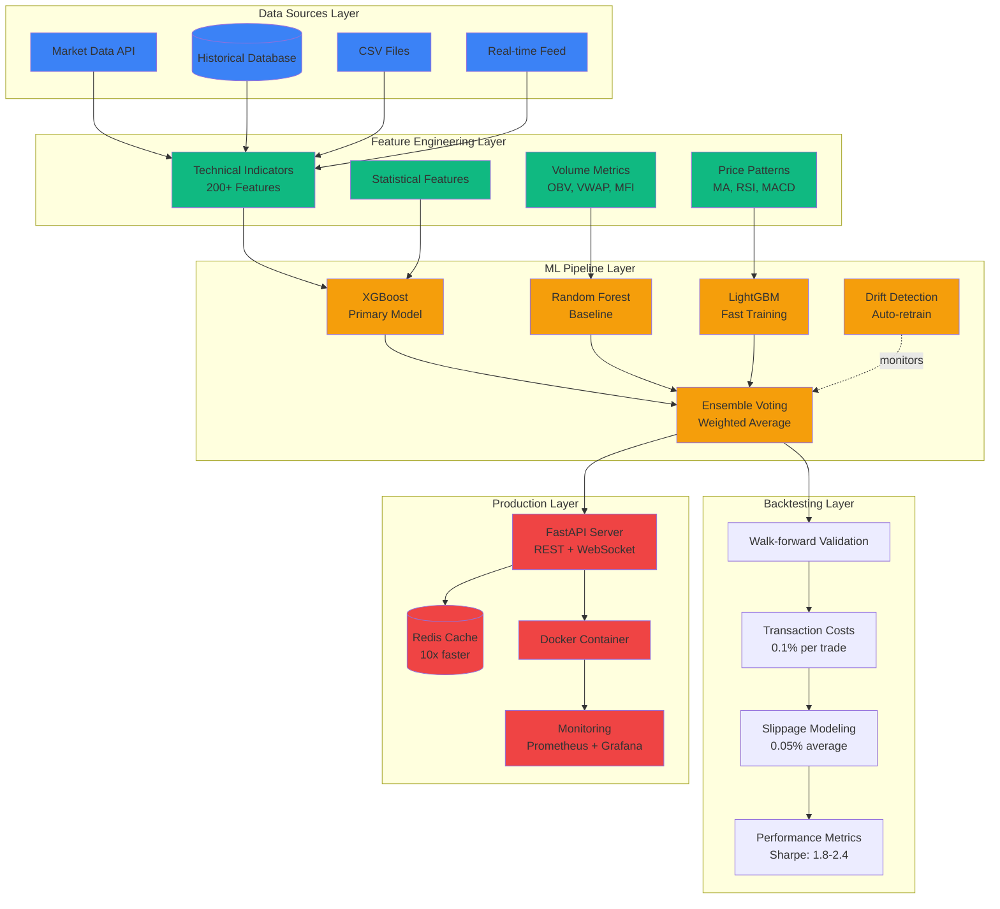
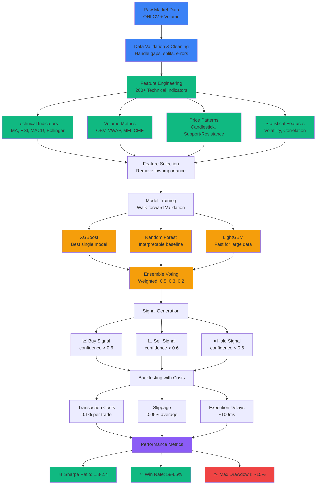
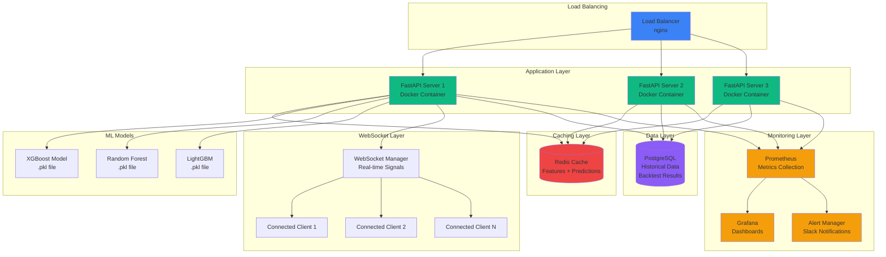

# AlphaStream - Architecture Diagrams (Mermaid Code)

## Diagram 1: System Architecture Overview



**To use:** Copy this Mermaid code into:
- Markdown file (renders automatically on GitHub)
- Mermaid Live Editor: https://mermaid.live/
- Export as SVG or PNG from Mermaid Live

---

## Diagram 2: ML Pipeline Data Flow



---

## Diagram 3: Deployment Architecture



---

## How to Use These Diagrams

### Option 1: Render in Markdown (Easiest)
1. Copy the Mermaid code blocks
2. Paste into your markdown files
3. GitHub, GitLab, and many markdown renderers support Mermaid natively

### Option 2: Export as Images
1. Go to https://mermaid.live/
2. Paste the Mermaid code
3. Click "Export" → Download PNG or SVG
4. Save to your project folder

### Option 3: Use in Documentation Tools
- Docusaurus: Supports Mermaid natively
- Gatsby: Use `gatsby-remark-mermaid`
- MkDocs: Use `mkdocs-mermaid2-plugin`

### Styling Tips
- The color scheme matches your portfolio (blue → green → orange → red)
- Keep background transparent when exporting
- Export at 2x resolution for crisp display
- Use SVG format for best quality (scalable)

---

## Alternative: ASCII Art Version

If you prefer simple ASCII diagrams for documentation:

```
┌─────────────────────────────────────────────────────────┐
│                  AlphaStream Architecture                │
└─────────────────────────────────────────────────────────┘

 ┌──────────────┐
 │ Data Sources │ → Market API, Historical DB, CSV, Real-time
 └──────┬───────┘
        │
        ▼
 ┌──────────────────┐
 │ Feature Engineer │ → 200+ Technical Indicators
 └──────┬───────────┘
        │
        ▼
 ┌────────────────────┐
 │   ML Pipeline      │ → XGBoost, RF, LightGBM → Ensemble
 └──────┬─────────────┘
        │
        ▼
 ┌────────────────────┐
 │   Backtesting      │ → Walk-forward + Costs → Sharpe: 1.8-2.4
 └──────┬─────────────┘
        │
        ▼
 ┌────────────────────┐
 │   Production       │ → FastAPI + WebSocket + Redis + Docker
 └────────────────────┘
```

This ASCII version works great for README files and documentation!
